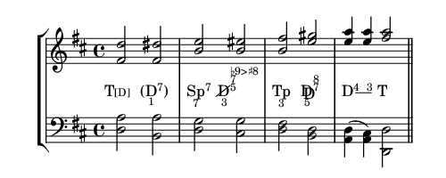

# harmonyli.ly

(C) Karsten Reincke - 2020 Hohenahr/Altenkrichen, Germany

A **library** for inserting **Functional Harmony Analysis Symbols** into musical 
scores encoded in and created by LilyPond.

## Installation
* Checkout the repository
* copy the file harmonyli.ly into any directory from which you want to include it
* Insert `include "YOURPATH/harmonyli.ly"` into your LilyPond file

## License:

_harmonyli.ly_ is distributed under the terms of the MIT license or under 
the terms of the GPLv3 license. As long as harmonyli.ly is distributed under 
both licenses, the recipient has the right to chose the license under which he
wants to use the work!

For details see the file [LICENSING](./LICENSING).

## Examples:

The package contains 6 examples by which the user can learn how to use
the library `harmonyli.ly`. Like all other LilyPond files, each example 
`example.ly` can be compiled by the command line order `make example.pdf` 
respectively `make example.png`:

* **minimal.ly** :- a good starting point
   [score](./minimal.ly) &rarr; [result](./img/minimal.png) 
* **cadenca.ly** :- analyses of the general reference cadence 
  * using the functional harmony theory 
   [score](./cadenca-func.ly) &rarr; [result](./img/cadenca-func.png) 
  * using the scale step theory
   [score](./cadenca-scale.ly) &rarr; [result](./img/cadenca-scale.png) 
* **sn967.ly** :- the re-implementation of a former example
   [score](./sn967.ly) &rarr; [result](./img/sn967.png) 
* **modulationi.ly** :- an example explaining how to represent modulations
  * using the functional harmony theory 
   [score](./modulation-func.ly) &rarr; [result](./img/modulation-func.png) 
  * using the scale step theory 
   [score](./modulation-scale.ly) &rarr; [result](./img/modulation-scale.png) 

## Usage:

**harmonyli.ly** offers some information:

1. '5 minutes turorial' (German)
[https://fodina.de/2019/harmonyli-ly-intro/](https://fodina.de/2019/harmonyli-ly-intro/)
2. '5 minutes turorial' (English)
[https://fodina.de/en/2019/harmonyli-ly-intro/](https://fodina.de/en/2019/harmonyli-ly-intro/)
3. Complete Tutorial (English)
[https://kreincke.github.io/harmonyli.ly/tutorial.pdf](https://kreincke.github.io/harmonyli.ly/tutorial.pdf)
4. Project Page (German)
[https://fodina.de/harmonyli.ly/](https://fodina.de/harmonyli.ly/)
5. Project Page (English)
[https://fodina.de/en/harmonyli.ly/](https://fodina.de/ien/harmonyli.ly/)

## Coming Features:

* The deeply embedded core function should be redesigned to use the overlay technique.
  This will be implemented as soon as LilyPond 2.19 or 2.20 is officially released and
  integrated into the standard Linux distributions. (Ubuntu 20.04 offers lilypond 2.20.xx, 
  so we now are able to start with that work. But it still takes some time)

