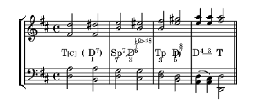

# harmonyli.ly

A library for inserting Functional Harmony Analysis Symbols into musical scores 
encoded in and created by LilyPond.

## Installation
* Checkout the repository
* copy the file harmonyli.ly into any directory from which you want to include it
* Insert `include "YOURPATH/harmonyli.ly"` into your LilyPond file

## License:

_harmonyli.ly_ is distributed under the terms of the MIT license or under 
the terms of the GPLv3 license. As long as harmonyli.ly is distributed under 
both licenses, the recipient has the right to chose the license under which he
wants to use the work.

For details se the file `LICENSING`.

## Usage:

See `doc/harmonylily-tutorial.pdf`